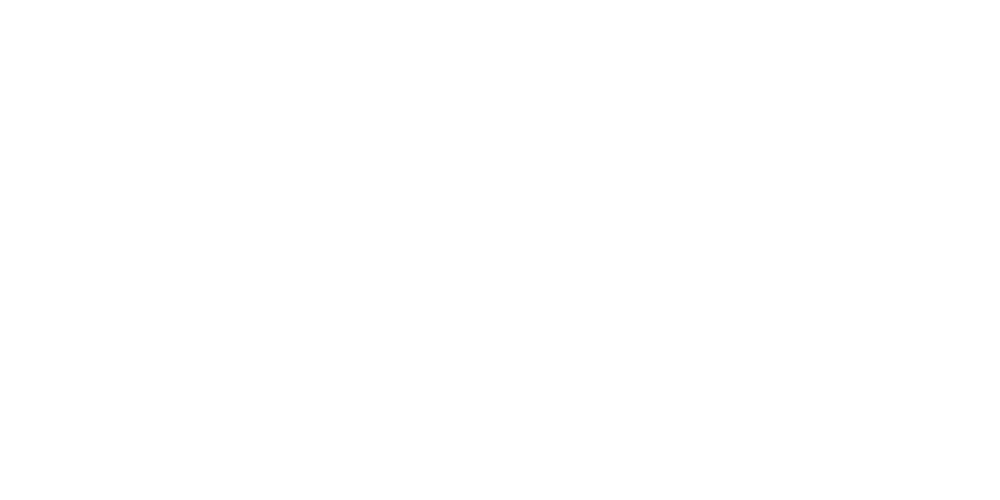
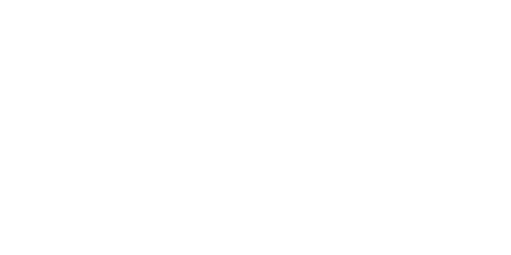
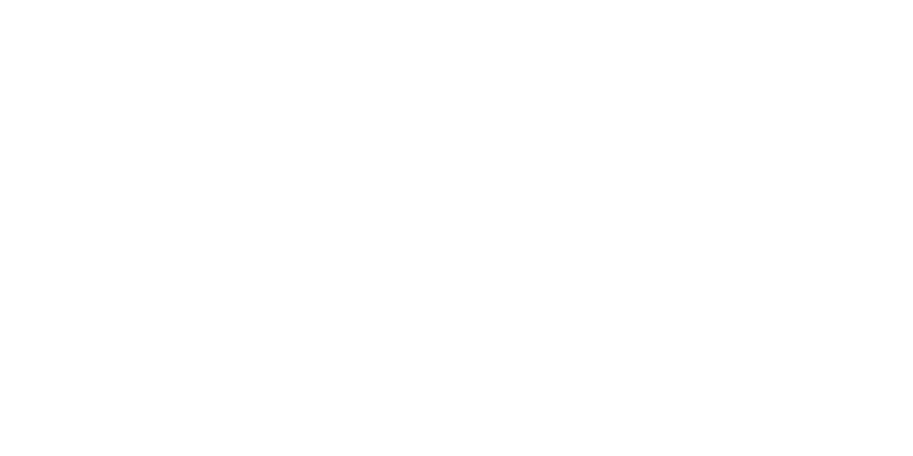
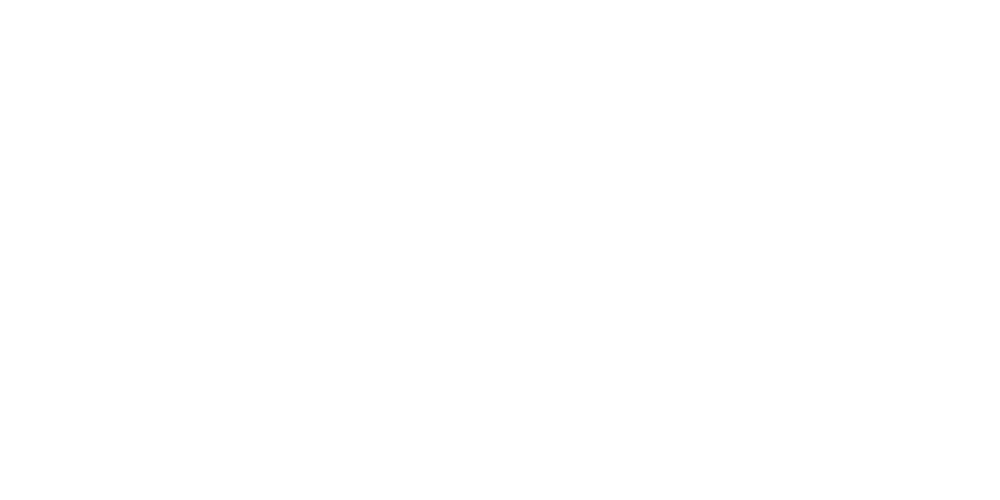

# DigiCow Farmer Training Adoption Challenge

## 📌 1. The Problem

The challenge was to predict the probability of farmers adopting agricultural practices across three distinct time horizons: **7 days, 90 days, and 120 days** after a training session.

This was not a standard classification task. It was a heavily imbalanced (~98% negative class), multi-horizon survival problem evaluated on both **AUC** (ranking ability) and **LogLoss** (probability calibration accuracy). The ultimate challenge lay in navigating a massive **Temporal Covariate Shift** between the 2024 training data and the unseen 2025 test data.

---

## 📊 2. Exploratory Data Analysis & Key Discoveries

Before engineering features, post-modeling EDA revealed exactly why standard approaches failed on the Leaderboard.

### Discovery A: The Temporal Covariate Shift

* **The Insight:** Plotting the distribution of training months revealed a severe misalignment between the Train (2024) and Test (2025) datasets.
* **The Action:** We had to make the model **Time-Blind**. Feeding the model absolute dates or cyclical seasonal components caused it to memorize 2024's weather and scheduling patterns, failing catastrophically on the 2025 data. We dropped all dates except `training_day_of_week` (a purely behavioral signal).


### Discovery B: The Cold Start Matrix

* **The Insight:** Venn diagrams of the `farmer_name` and `trainer` IDs showed a massive influx of completely new entities in the Test set with zero historical footprint.
* **The Action:** We could not rely on absolute "Volume" counts (e.g., total past adoptions). Explicitly flagging these as "Cold Starts" also triggered Covariate Shift penalties. Instead, we relied purely on calculated historical *rates* and filled missing entities with the global mean.


### Discovery C: The Extreme Class Imbalance Funnel

* **The Insight:** Analyzing cumulative adoption rates showed an incredibly steep imbalance, with overall adoption resting under 3%.
* **The Action:** Because LogLoss severely punishes confident false positives on a 98% negative class, standard Arithmetic blending was too dangerous. This required the implementation of a Geometric consensus blend.


### Discovery D: NLP Topic Dominance

* **The Insight:** Plotting training module frequency against adoption success revealed that certain keywords drastically outperformed others. However, the exact courses offered changed between 2024 and 2025.
* **The Action:** Instead of hard-coding the historical success of specific topics, we used a **50-component TF-IDF Vectorizer** to let the tree models dynamically learn the underlying vocabulary of success.


---

## 🚧 3. The Journey & Obstacles Encountered

Reaching the 0.953+ summit required navigating several hidden traps:

1. **The Isotonic Plateau Trap:** Early attempts to use `IsotonicRegression` perfectly optimized LogLoss but created flat probability "plateaus" that destroyed our AUC rankings because of massive prediction ties. *Fix: Seed Averaging to create microscopic variance.*
2. **Sequential Chaining Leakage:** We attempted to feed the 7-day OOF predictions directly into the 90-day model. *Result:* The 90-day model became "lazy," ignored the raw features, and suffered on the unseen Test set.
3. **The "Armor" Overfit:** We applied heavy L1/L2 regularization and probability clipping floors (e.g., `0.002`). *Result:* Artificially raising the floor on 98% of the negative rows multiplied our LogLoss penalty.

---

## 🚀 4. The Breakthroughs (Final Architecture)

Our final, most resilient submission (**The 15-Fold Shield**) relied on four grandmaster-level mechanics:

### I. Pure Multi-Horizon Target Encoding

Every entity (`farmer`, `trainer`, `group`) received distinct historical adoption rates perfectly matched to the target horizon (7D history for the 7D model, 90D history for the 90D model).

### II. The Dual-Engine Amputation & Slow Burn

We amputated XGBoost entirely, as its aggressive tail-end predictions introduced noise into the heavily imbalanced LogLoss penalty. The final engine consisted purely of **LightGBM** and **CatBoost**.

* We utilized an extreme "Slow Burn" approach: `1500` estimators at a `0.01` learning rate.
* Trees were brutally pruned to `max_depth = 4` with extreme feature dropout (`colsample = 0.4`) to force the models to learn the high-resolution NLP features instead of relying solely on historical rates.

### III. The 70/30 Hybrid Master Blend

To perfectly balance the dual metrics of the competition:

* **Arithmetic Mean** maximizes AUC ranking.
* **Geometric Mean** requires absolute model consensus, violently crushing overconfident false positives to protect LogLoss.
* **The Master Blend:** $P_{final} = (P_{geom} \times 0.70) + (P_{arith} \times 0.30)$

### IV. The 0.01% Mathematical Dampener

As a final insurance policy against the Private Leaderboard "Shake-Up," we applied a microscopic dampener to the final probabilities:
`Prediction = (Prediction * 0.999) + 0.0005`
This safely bounds the probabilities away from absolute 0.0 and 1.0 without flattening the AUC rank, preventing infinity penalties on unpredictable edge cases.

---

## 🧠 5. Lessons Learned

* **Covariate Shift is the Silent Killer:** If a feature relies on absolute time, volume, or explicitly flags the future, it will betray you on the Private Leaderboard.
* **CV vs. LB Trust:** When 15-Fold CV improved our local score but dropped on the Public LB, it taught us the delicate balance of data exposure. We only returned to 15 Folds after mathematically blinding the model to the time traps.
* **Geometric Blending:** In imbalanced datasets, requiring model consensus via multiplication ($A \times B$) is vastly superior to addition ($A + B$) for surviving LogLoss.

---

## 📂 6. Repository Structure

```text
├── data/
│   ├── raw/                 # Train.csv, Test.csv, Prior.csv
│
├── notebooks/
│   ├── 01_EDA.ipynb         # Exploratory Data Analysis & Visualizations
│   ├── 02_Farmer_training.ipynb # TF-IDF and Target Encoding logic
│   
├── src/
│   ├── features.py          # Data pipeline (Multi-Horizon encoding, NLP)
│   ├── models.py            # Dual-Engine 15-Fold training script
│   └── post_processing.py   # Hybrid blending and Monotonicity logic
├── submissions/             # Final CSV outputs
├── README.md                # Project documentation
└── requirements.txt         # Dependencies

```

**To reproduce the final submission:**

1. Place raw data in `data/raw/`
2. Install dependencies: `pip install -r requirements.txt`
3. Execute the pipeline from the root directory using the scripts in `/src`.

---